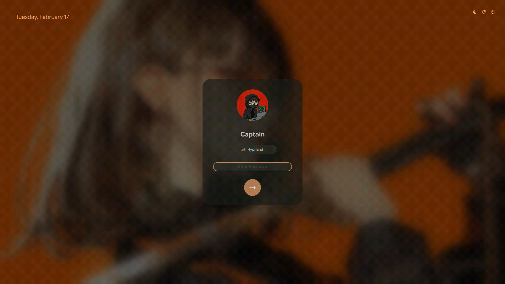
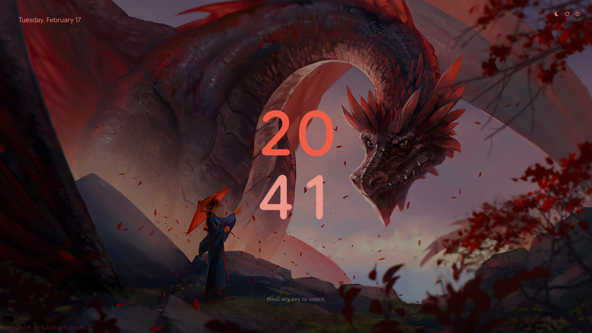
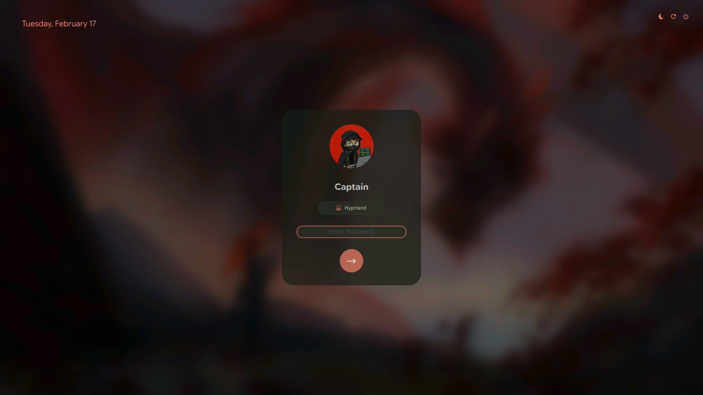
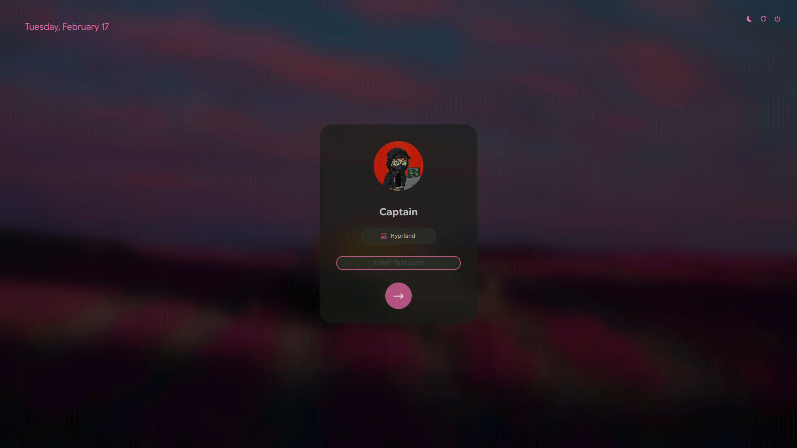

# ✨ Pixie SDDM

A clean, modern, and minimal SDDM theme inspired by Google Pixel UI and Material Design 3. Supports both the latest **Qt6** engine and legacy **Qt5** systems.

<div align="center">
  
  
</div>

<div align="center">
  
  
  
  
</div>

<div align="center">
  
  
  
  
</div>

## 🌟 Features

- **Pixel Aesthetic:** Clean typography and a unique two-tone stacked clock.
- **Material You Dynamic Colors:** Intelligent color extraction that samples your wallpaper for UI accents.
- **Next-Gen Blur:** High-performance Gaussian blur (Qt6) and custom shader blur (Qt5).
- **Universal Circle Avatar:** A bulletproof, anti-aliased circular profile mask that works on all systems.
- **Material Design 3:** Dark card UI with smooth interactions and responsive dropdowns.
- **Keyboard Navigation:** Full support for navigating menus with arrows and `Enter`.

---

## 🛠 1. Prerequisites (Essential)

Before installing, ensure you have the required modules for your system version to avoid a black screen:

<details open>
<summary><b>Qt6 (Default / Modern Distros)</b></summary>
Recommended for Fedora 40+, Arch Linux, CachyOS, NixOS.

```bash
# Arch:
sudo pacman -S qt6-declarative qt6-svg qt6-quickcontrols2

# Fedora:
sudo dnf install qt6-qtdeclarative qt6-qtsvg qt6-qtquickcontrols2

# Debian 13/Testing:
sudo apt install libqt6quick6 libqt6qml6 libqt6svg6 libqt6quickcontrols2-6
```
</details>

<details>
<summary><b>Qt5 (Legacy / Stable Distros)</b></summary>
Required for Ubuntu 22.04/24.04, Debian 12, Linux Mint.

```bash
# Ubuntu: sudo apt install qml-module-qtgraphicaleffects qml-module-qtquick-controls2
# Arch: sudo pacman -S qt5-graphicaleffects qt5-quickcontrols2
```
</details>

---

## 📦 2. Installation

Pixie SDDM automatically detects your system and installs the correct version.

| System Type | Engine | Recommended Branch |
| :--- | :--- | :--- |
| **Bleeding Edge** (Fedora, Arch, Nix) | **Qt6** | `main` (Default) |
| **Stable/LTS** (Ubuntu, Debian) | **Qt5** | `qt5` |

### Method A: Automatic Script (Recommended)
This script intelligently detects your Qt version and handles everything:
```bash
git clone https://github.com/xCaptaiN09/pixie-sddm.git
cd pixie-sddm
sudo ./install.sh
```

### Method B: Arch Linux (AUR)
The AUR package automatically tracks the latest modern version:
```bash
yay -S pixie-sddm-git
```

### Method C: NixOS (Flake)
The most modern and flexible way to install.

1. In your **`flake.nix`**, add the input and pass it to your modules:
```nix
{
  inputs.pixie-sddm.url = "github:xCaptaiN09/pixie-sddm";

  outputs = { self, nixpkgs, pixie-sddm, ... }@inputs: {
    nixosConfigurations.YOUR_HOSTNAME = nixpkgs.lib.nixosSystem {
      specialArgs = { inherit inputs; }; # Passes inputs to all modules
      modules = [ ./configuration.nix ];
    };
  };
}
```

2. In your **`configuration.nix`**, configure SDDM and apply the theme:
```nix
{ pkgs, inputs, ... }: {
  services.displayManager.sddm = {
    enable = true;
    theme = "pixie";
    wayland.enable = true; # Optional: for Wayland sessions

    # Crucial for Qt6: Use the KDE/Qt6 build of SDDM to fix missing
    # cursors and module errors.
    package = pkgs.kdePackages.sddm;

    # Required dependencies for Qt6 themes
    extraPackages = [
      pkgs.kdePackages.qtsvg
      pkgs.kdePackages.qtdeclarative
      pkgs.kdePackages.qt5compat
    ];
  };

  environment.systemPackages = [
    # Install and customize the theme. All fields are optional and will
    # fall back to theme defaults if not set.
    (inputs.pixie-sddm.packages.${pkgs.stdenv.hostPlatform.system}.pixie-sddm.override {
      background = ./my-background.jpg; # Nix path or absolute path
      avatar = ./my-avatar.jpg;         # Nix path or absolute path
      primaryColor = "#B3C8FF";         # Hex color code
      accentColor = "#3F5F91";          # Hex color code
      autoColor = true;                 # true/false
      backgroundColor = "#1A1C1E";      # Hex color code
      textColor = "#E2E2E6";            # Hex color code
      fontFamily = "JetBrains Mono";    # Font family name
      fontSize = 13;                    # Font size in px
    })
  ];
}
```

### Method D: NixOS (Legacy / Non-Flake)
Add the following to your `configuration.nix`. (Change `rev = "main"` to
`rev = "qt5"` for legacy systems).

> [!NOTE]
> For Qt6: If you are using the `main` (Qt6) branch, you **must** use
> `pkgs.kdePackages.sddm` to ensure the Qt6 platform plugins load
> correctly. Without this, your mouse cursor may not appear.

```nix
{ pkgs, ... }: {
  services.displayManager.sddm = {
    enable = true;
    theme = "pixie";
    # Crucial for Qt6: Use the KDE/Qt6 build of SDDM to fix missing cursors and module errors
    package = pkgs.kdePackages.sddm;

    # Fix for NixOS explicitly requiring a cursor theme
    settings = {
      Theme = {
        CursorTheme = "breeze_cursors"; # Change this if you use a different cursor theme (e.g., Adwaita)
      };
    };
  };

  environment.systemPackages = [
    (pkgs.stdenv.mkDerivation {
      name = "pixie-sddm";
      src = pkgs.fetchFromGitHub {
        owner = "xCaptaiN09";
        repo = "pixie-sddm";
        rev = "main";
        hash = pkgs.lib.fakeHash;
      };
      installPhase = "
        mkdir -p $out/share/sddm/themes/pixie
        cp -r * $out/share/sddm/themes/pixie/
      ";
    })
    # Correct Qt6 dependencies for NixOS
    pkgs.kdePackages.qtdeclarative
    pkgs.kdePackages.qtsvg
    pkgs.kdePackages.qt5compat # Included for wider QML component compatibility
  ];
}
```

### Method E: Manual
1. Copy the folder to SDDM themes directory:
   `sudo cp -r pixie-sddm /usr/share/sddm/themes/pixie`
2. Set the theme in `/etc/sddm.conf`:
   ```ini
   [Theme]
   Current=pixie
   ```

---

## 🛠 Configuration & Testing

### Preview Without Logging Out
Run this command to preview the theme safely:
```bash
# For Qt6 (Modern):
sddm-greeter-qt6 --test-mode --theme /usr/share/sddm/themes/pixie

# For Qt5 (Legacy):
sddm-greeter --test-mode --theme /usr/share/sddm/themes/pixie
```

### Customization
Edit `theme.conf` or replace assets in `assets/`:
- **Wallpaper:** Replace `assets/background.jpg`.
- **Avatar:** Replace `assets/avatar.jpg`.
- **Dynamic Colors:**
  - `autoColor=true` (Default): Automatically extracts a Material You accent color from your wallpaper.
  - `autoColor=false`: Disables extraction and strictly uses the `accentColor` you set in `theme.conf`.
- **Background Colors:** Change `backgroundColor` in `theme.conf`. The login card, input fields, and borders will automatically generate lighter variants to match.
- **Clock Format:** Set `use24HourClock=false` in `theme.conf` to switch to a 12-hour clock, or `use24HourClock=true` for 24-hour.

## 🤝 Credits

- **Author:** [xCaptaiN09](https://github.com/xCaptaiN09)
- **Design:** Inspired by Google Pixel and MD3.
- **Font:** Flex Rounded & Material Design Icons (included).

---
*Made with ❤️ for the Linux community.*
